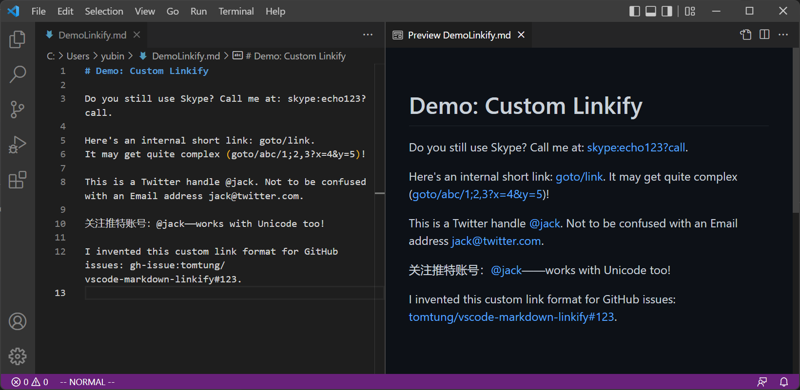

# VS Code: Custom Linkification in Markdown Preview



This extension customizes automatic linkification of texts rendered in Markdown Preview.

## Extension Settings

By adding rules to the `"markdown-linkify.rules"` settings, the user can specify how links with custom formats are matched, linked, and rendered.

The value of `"markdown-linkify.rules"` is a list of custom linkification rules, each represented by a JSON object with 4 members:
```typescript
interface Rule {
    prefix: string
    tail?: string
    url?: string
    text?: string
}
```
- `prefix`: the prefix of link strings to be matched, most typically a protocol name that ends with `:` (like `skype:`). The match is automatically ensured to not be preceded by an alphanumeric character.
- `tail`: an optional regex for matching the **remainder** of the link string immediately following the prefix. The match is automatically ensured to be immediately followed by either space or punctuation. *If not provided, defaults to matching URI-path-like strings.*
- `url`: an optional string template for the rendered link's URL. *If not provided, defaults to the matched link string, possibly prepended by `http://`.*
- `text`: an optional string template for the rendered link text. *If not provided, defaults to the matched link string.*

Both template strings can contain placeholders of matched (sub)strings (`%MATCH%`, `%PREFIX%`, and `%TAIL%`) and backreferences (`$1`, `$2`, ...) to capturing groups from the `tail` regex. The placeholder `%MATCH%` is replaced with the entirety of the matched link string, while `%PREFIX%` only the prefix part, `%TAIL%` only the tail part.

## Examples

The custom linkification demonstrated in the screenshot above is enabled by the following setting:

```json
{
    "markdown-linkify.rules": [
        { "prefix": "skype:" },
        { "prefix": "goto/" },
        {
            "prefix": "@",
            "tail": "([a-zA-Z0-9_]){1,15}(?!_)",
            "url": "https://twitter.com/%TAIL%"
        },
        {
			"prefix": "gh-issue:",
			"tail": "([a-zA-Z\\d](?:[a-zA-Z\\d]|-(?=[a-zA-Z\\d]))+)\/([a-zA-Z.\\-_]+)(?:#(\\d+))",
			"url": "https://github.com/$1/$2/issues/$3",
			"text": "%TAIL%"
		}
    ]
}
```

Let's break it down in the following sections.

### Custom URI Scheme

With the first simple rule:

```json
{ "prefix": "skype:" }
```

the text

```
Do you still use Skype? Call me at: skype:echo123?call.
```

is rendered to

> <p>Do you still use Skype? Call me at: <a href="skype:echo123?call">skype:echo123?call</a>.</p>

### Non-URI Link Prefix

Similarly, with the rule:

```json
{ "prefix": "goto/" }
```

the text

```
Here's an internal short link: goto/link.
It may get quite complex (goto/abc/1;2,3?x=4&y=5)!
```

is rendered to

> <p>Here's an internal short link: <a href="http://goto/link">goto/link</a>. It may get quite complex (<a href="http://goto/abc/1;2,3?x=4&amp;y=5">goto/abc/1;2,3?x=4&amp;y=5</a>)!</p>

Here since `goto/` doesn't look like a valid URI prefix, `http://` is automatically prepended to the link URL by default.

### Matching with Regex, Linking with Template
The next rule matches Twitter handles using regex, and constructs link URLs using a template string.
```json
{
    "prefix": "@",
    "tail": "([a-zA-Z0-9_]){1,15}(?!_)",
    "url": "https://twitter.com/%TAIL%"
}
```

With this rule, the text

```
This is a Twitter handle @jack.
Not to be confused with an Email address jack@twitter.com.
```

is rendered to
> <p>This is a Twitter handle <a href="https://twitter.com/jack">@jack</a>. Not to be confused with an Email address <a href="mailto:jack@twitter.com">jack@twitter.com</a>.</p>

### Overriding Link Text

The final rule demonstrates a more advanced use case: in addition to matching the tail with a regex and constructing the link URL with backreferences to capturing groups in the regex, it also drops the prefix string when rendering the link text.

```json
{
    "prefix": "gh-issue:",
    "tail": "([a-zA-Z\\d](?:[a-zA-Z\\d]|-(?=[a-zA-Z\\d]))+)\/([a-zA-Z.\\-_]+)(?:#(\\d+))",
    "url": "https://github.com/$1/$2/issues/$3",
    "text": "%TAIL%"
}
```

With this rule, the following text:

```
I invented this custom link format for GitHub issues:
gh-issue:tomtung/vscode-markdown-linkify#123.
```

is rendered to

> <p>I invented this custom link format for GitHub issues: <a href="https://github.com/tomtung/vscode-markdown-linkify/issues/123">tomtung/vscode-markdown-linkify#123</a>.</p>

## Contributing

See [`CONTRIBUTING.md`](CONTRIBUTING.md) for details.

## License

Apache 2.0; see [`LICENSE.txt`](LICENSE.txt) for details.

## Disclaimer

This project is not an official Google project. It is not supported by Google and Google specifically disclaims all warranties as to its quality, merchantability, or fitness for a particular purpose.
